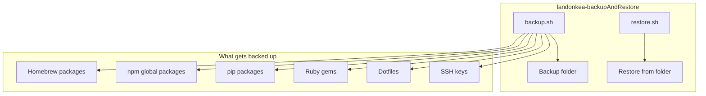
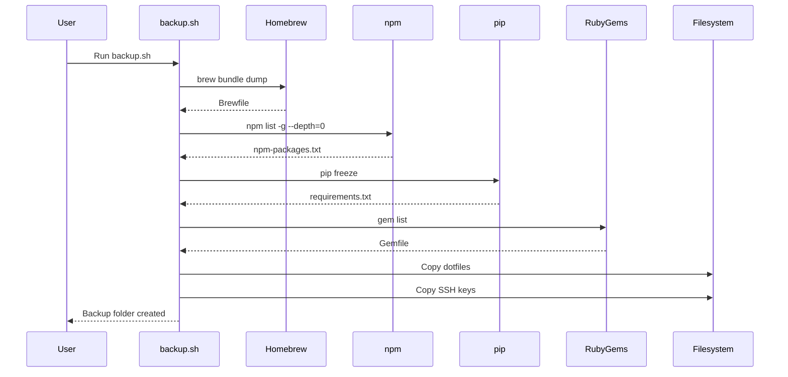
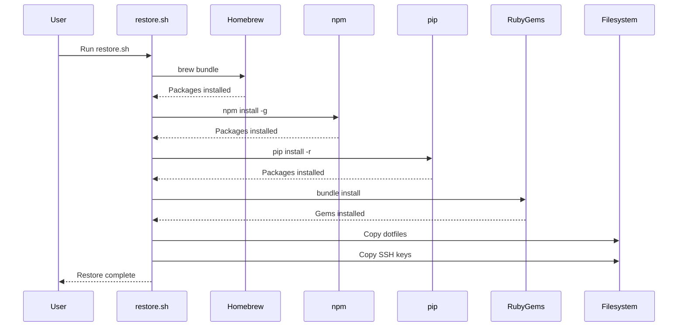

# landonkea-backupAndRestore - Design & Workflow

## High-Level Overview

## Backup Workflow

## Restore Workflow

## File Relationships

| File | Purpose | Used By |
|------|---------|---------|
| `backup.sh` | Create backup | User |
| `restore.sh` | Restore from backup | User |
| `Mac_Backup_*/` | Backup data | `restore.sh` |

## draw.io

[Open in draw.io](https://app.diagrams.net/#RBackup%20restore%20workflow)
